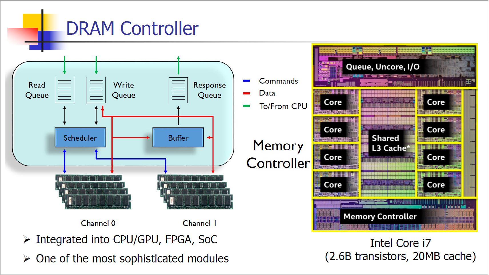
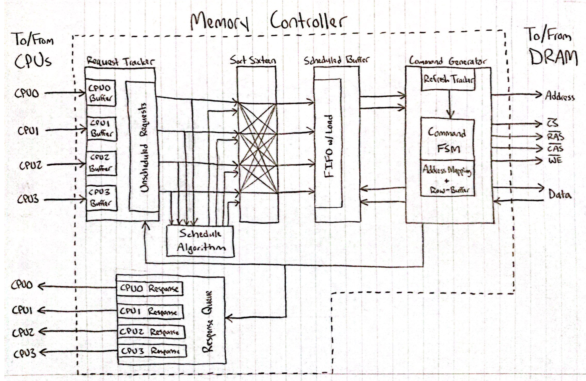
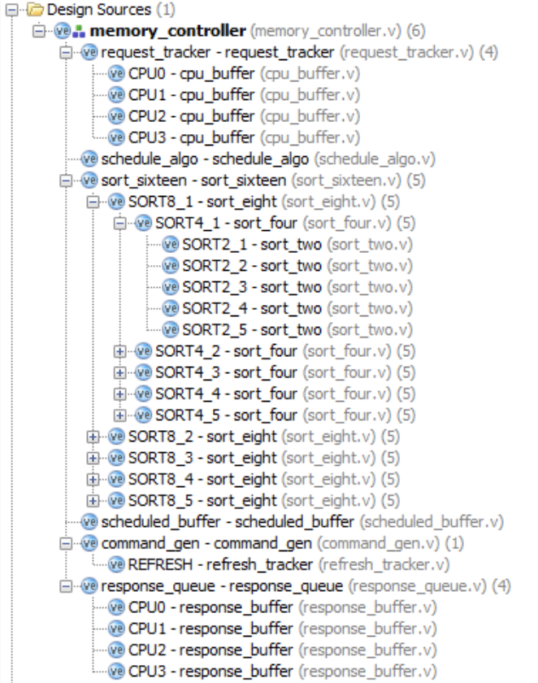
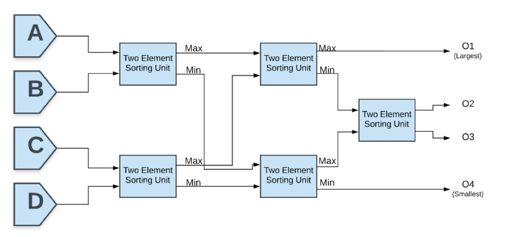
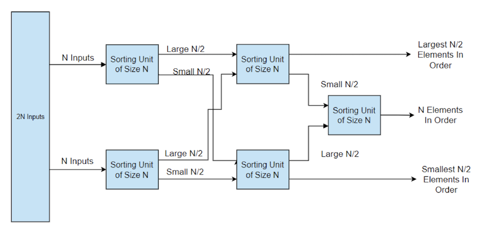
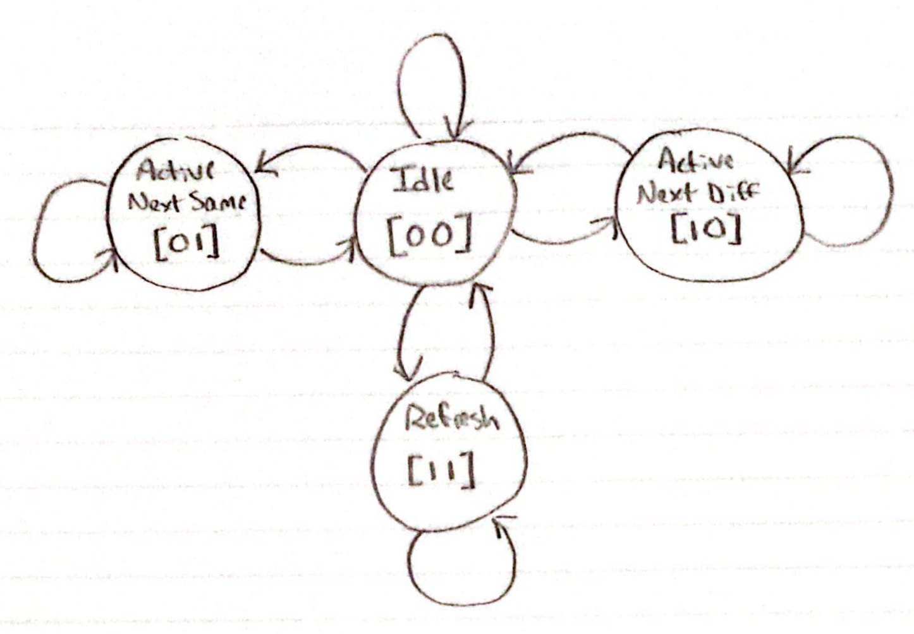
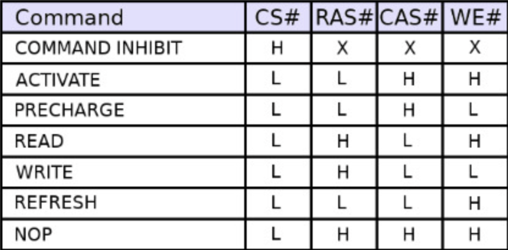
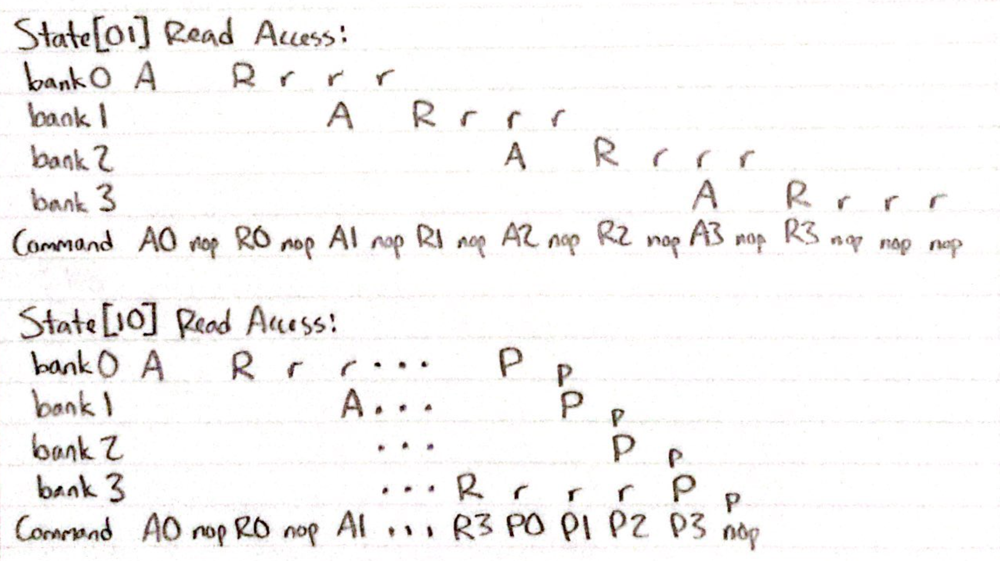

<div id="top"></div>

<!-- ABOUT THE PROJECT -->

## About the Project

The object of this project is to design a DDR memory controller using Verilog. The memory controller is one of the most complex components in the CPU and is used as an interface between the DRAM and the rest of the CPU. It is responsible for, among other things, recieving read and write requests from the CPU, scheduling the request order, implementing row-buffer management policies, and controlling address mapping schemes. 

<br />
<div align="center">
  <a href="https://github.com/Nesathurai/advanced_computer_systems.git">
    
  </a>
<div align="left">

<div align="center">
Source: Professor Tong Zhang's Part3.pdf, Advanced Computer Systems, ECSE 4961
<div align="left">
<br />

The designed memory controller has the following features:

- Up to 4 CPUs may simultaneously make requests
- Allows CPUs to assign a priority to each request
- Dynamic request scheduling
- Automatically refreshes the DRAM every 64ms
- Address mapping optimized for the row-buffer management policy
- Open row-buffer management policy ideal for localized accesses

<p align="right">(<a href="#top">back to top</a>)</p>

## Installation and Usage
  
As this is a hardware design project, there is no code to necessarily run. However, the project is available to view, synthesize, and implement in Vivado. You do not need Vivado to view the Verilog code, you may view the Verilog code as text files using a text editor. 
<br />

1. Install Vivado 2016.2

You should be able to create a free account with your RPI email address.
Download the windows copy [here.](https://www.xilinx.com/member/forms/download/xef.html?filename=Xilinx_Vivado_SDK_2016.2_0605_1_Win64.exe)

Note: Design and Synthesis was performed using Vivado 2016.2, but other similar software may work too. 

```sh
open the installer and install Vivado 2016.2
enter email and password when prompted
```

[https://github.com/Nesathurai/advanced_computer_systems.git](https://github.com/Nesathurai/advanced_computer_systems.git)

2. Download github repo

```sh
git clone https://github.com/Nesathurai/advanced_computer_systems.git
```

3. Go to cloned folder and open the project in Vivado 2016.2, or view the Verilog .v files with a text editor. 

```sh
cd advanced_computer_systems
cd project5
cd Vivado
```

<p align="right">(<a href="#top">back to top</a>)</p>

<!-- STRUCTURE -->

## Structure

The memory controller is assembled of many smaller modules. Each module describes either a base level component, or a higher level component which combines other base level components. For example, the module which sorts the requests has the following structure: at the smallest level, there is a sort_two module which sorts two inputs, then five sort_two instances are combined to create the sort_four module, and then five sort_four instances are combined to create the sort_eight module, etc.

<br />
<div align="center">
  <a href="https://github.com/Nesathurai/advanced_computer_systems.git">
    
  </a>
<div align="left">
<br />

At a high level, the memory controller can be described as a combination of six medium-size modules. Shown above is an image of the top-level design, showcasing the request tracker, the schedule algorithm, the sorting block, the scheduled buffer, the command generator, and the response queue. The memory controller takes requests from CPUs as inputs to the request tracker. The request tracker holds all input requests until they are completed. The active requests are output to the schedule algorithm and the sort_sixteen module, which together sort the up to sixteen requests by age, CPU-defined priority, and read/write status. The output of the sort is then captured by the scheduled buffer, which holds the current inventory of sorted requests. The top request, as well as the row address of the next request, are output to the command generator. The command generator sends to the DRAM the signals necessary for completing the request, and the completed request is sent to the response queue and removed from the request buffer.
  
Many of these medium-size modules are described in terms of smaller modules, such as FIFO buffers, counters, or smaller width sorters. Shown below is the hierarchy of modules implemented in this design. 

<br />
<div align="center">
  <a href="https://github.com/Nesathurai/advanced_computer_systems.git">
    
  </a>
<div align="left">

### Request Tracker Structure
The input requests from the CPUs are received by four FIFO buffers, one for each possible CPU. The request tracker takes requests one at a time from these FIFO buffers based on whichever one is the most full. Each entry in the request tracker buffer has a validity bit associated with it, and whenever that bit is high for a particular entry, that means it is occupied. A new request from the FIFO buffers is added wherever the validity bit is low, and the bit is set high. Upon request completion, the entry is once again freed up by setting the bit low. The age of requests is also kept track of in the request tracker, where for every eight clock cycles, the age increases by 1. All entries and entry properties such as validity and age are output to the sorter module. 
<br />
  
### Schedule Algorithm Structure
The schedule algorithm takes as input the CPU-defined priority of each entry, the validity of each entry (if the validity bit is low, there is no request there), the age of each entry, and the read/write status of each entry. The schedule priority is assigned based on the below formula:
```sh
schedule_priority[i] = valid[i] * (weighted_priority[i] + (4 * read[i]) + age[i])
```
As can be seen, if there is no request active in the entry, the priority is automatically set to zero. Read requests have a higher priority than write requests, and requests will be scheduled sooner the longer they have been waiting. 
<br />

### Sorter Structure
The sorter organizes sixteen elements based on their scheduled priority. The elements are output in order. It is immediately obvious how to sort two elements using a comparator, but it is not as intuitive to sort a larger number of elements using logic. 
  
  One method that was considered was using the well-known merge sort algorithm in hardware. The steps could be implemented easily up until two groups of two elements would need to be combined. This could be implemented by using a two-element comparator for the smaller elements, moving the smaller element to the output, and incrementing a pointer. Doing this three times will result in a group of four sorted elements. The same strategy can be upscaled to sort any number of elements. This is space efficient, but extremely costly with respect to time. Many clock cycles are required to increment pointers and go through every element at each level, making this method ill-suited for a high speed memory controller. 

  The decided-upon method uses only combinational logic to avoid using up clock cycles. To sort four elements, one can start by putting the two sets of two inputs through two-element comparators. Putting the two higher outputs of those comparators through another comparator obtains the highest of the four values. Putting the lower two outputs of the first two comparators through a comparator obtains the lowest of the four values. The middle two values can be found using a fifth comparator. This four-element combinational sort is shown in the below image. 

<br />
<div align="center">
  <a href="https://github.com/Nesathurai/advanced_computer_systems.git">
    
  </a>
<div align="left">

<div align="center">
Source: Analysis of Hardware Sorting Units in Processor Design by Carmelo Furlan
<div align="left">
<br />

Beautifully, this method can be scaled up to sort 2n elements by using five of the n-size sorting elements, as shown below.

<br />
<div align="center">
  <a href="https://github.com/Nesathurai/advanced_computer_systems.git">
    
  </a>
<div align="left">

<div align="center">
Source: Analysis of Hardware Sorting Units in Processor Design by Carmelo Furlan
<div align="left">
<br />  

This is iterated several times to obtain a module that can combinationally sort sixteen elements. While the space taken by the sorter increases by a factor of five for each time the number of elements is multiplied by two, the time taken is only multiplied by a factor of three, making this an ideal sorting method for the memory controller. 
<br />

### Scheduled Buffer Structure
The scheduled buffer takes as input the sorted list of requests. The scheduled buffer will wait to load the updated requests in until the command generator is ready, as to optimize the throughput of the currently sorted requests. The scheduled buffer sends the current active request to the command generator, as well as the row address of the following request. The row address of the following request is used to determine whether or not the row buffer should continue to hold the current row. 
<br />

### Command Generator Structure
The command generator takes the current active request and the row address of the next request as inputs, and uses these to directly command the DRAM. The command generator is mainly controlled by a finite state machine with four states. The four implemented states are Idle, Active and Same Next Row, Active and Different Next Row, and Refresh. Shown below is a simplified finite state machine diagram.

<br />
<div align="center">
  <a href="https://github.com/Nesathurai/advanced_computer_systems.git">
    
  </a>
<div align="left">
<br />

The commands that are output by the command generator are directly controlled by the state of the FSM, the inputs from the scheduled buffer, and a counter that determines how long the command generator has been in a specific state. For example, if the command generator is idle, the output command will be "Command Inhibit". The structure of the output commands is also important. There are four outputs that control which command is occurring: CS#, RAS#, CAS#, and WE#. The outputs that should be active for each command are shown below:

<br />
<div align="center">
  <a href="https://github.com/Nesathurai/advanced_computer_systems.git">
    
  </a>
<div align="left">
<br />

For example, if the Activate command is desired, the control outputs will be {CS#, RAS#, CAS#, WE#} = 4'b0011. The state that the command generator is in will determine which command is desired. Example control outputs are given below. If the Activate command is desired at a bank with address 1, the command in the image will be A1. If a precharge is desired at a bank with address 3, the command will be P3. 

<br />
<div align="center">
  <a href="https://github.com/Nesathurai/advanced_computer_systems.git">
    
  </a>
<div align="left">
<br />

As can be seen, the length of time the request takes up and the commands which are utilized differ depending on what state the command generator is in. If the command generator is in state[01], which means that the row address of the next request is the same as the row address of the current request, no Precharge commands are necessary at the end of the request. This is because the row buffer does not need to be reset; the same row will be used for the next request. When the command generator is in state[10], meaning the next request has a different row address, the row buffer must be reset. Therefore, Precharge commands must be given to every bank to prepare for the next request. 
<br />

The address mapping scheme determines how the DRAM receives the addresses given by the CPU requests. The mapping scheme can dramatically affect the performance of the DRAM. As such, it is important to optimize. With an open row-buffer policy, where the row buffer is held until a request has a different row address, it is desired that the row address changes as rarely as possible. With any degree of access locality, this means that the row address should ideally be the most significant bits of any memory address. The address mapping scheme implemented by this memory controller is shown below.

<br />
<div align="center">
  <a href="https://github.com/Nesathurai/advanced_computer_systems.git">
    
  </a>
<div align="left">
<br />

The DRAM refresh is another critical element of the command generator. If the current DRAM data is not refreshed often enough, the capacitors holding the data will lose charge until the data is lost. This memory controller refreshes the DRAM every 64ms to ensure that the data is not lost. A counter inside the command generator keeps track of how long it has been since the last refresh. If the time is over approximately 63ms, a refresh is queued. As soon as the command generator enters the idle state, it will next enter the refresh state if a refresh is queued. In the refresh state, the command generator iterates through every row address and issues the Refresh command, ensuring that the data does not get lost. 

<p align="right">(<a href="#top">back to top</a>)</p>

<!-- Conclusion -->

## Conclusion
Memory controllers are massively complex elements of hardware that fulfill many critical tasks. Neither the CPU nor the DRAM will be able to operate optimally, or at all, with a sub-par or dysfunctional memory controller. While there are certainly improvable elements of this memory controller, it covers many of the critical functions and does so with reliable speed. 
<br />

One way in which this memory controller could be improved is by increasing the size of the request tracker. Only being able to hold sixteen elements at a time would possibly make this controller encounter issues if employed on a real system. This would also require more complex and optimized sorters and buffers. A second way in which it could be improved is by staggering the refresh process. Currently, when a refresh is queued, the controller refreshes every DRAM location. In a real system, this will cause large amounts of latency for a brief period of time while the DRAM is refreshing. A more fluid solution would be to stagger the refreshes and to make sure that each segment is refreshed at least once every 64ms, but this would make the refresh system and command generator both significantly more complex. 
<br />

Through implementing and analyzing this memory controller, the complexities and tradeoffs in design have become clear. With the high demands of modern hardware and the deep intricacies involved with designing a controller such as this, it is staggering how masterfully hardware such as this is designed today. This was a great experience to sample what it is like to construct such a complex, yet necessary, element of computing systems. 
<br />

<p align="right">(<a href="#top">back to top</a>)</p>

<!-- CONTACT -->

## Contact

Allan Nesathurai - ahnesathurai@gmail.com

Bennett Young - bennett.young@comcast.net

Project Link: [https://github.com/Nesathurai/advanced_computer_systems](https://github.com/Nesathurai/advanced_computer_systems)

<p align="right">(<a href="#top">back to top</a>)</p>

<!-- ACKNOWLEDGMENTS -->

## Acknowledgments

- [README Template](https://github.com/othneildrew/Best-README-Template)
- [ZSTD v1.5.2 Manual](https://raw.githack.com/facebook/zstd/release/doc/zstd_manual.html)

<p align="right">(<a href="#top">back to top</a>)</p>

<!-- MARKDOWN LINKS & IMAGES -->
<!-- https://www.markdownguide.org/basic-syntax/#reference-style-links -->

[contributors-shield]: https://img.shields.io/github/contributors/github_username/repo_name.svg?style=for-the-badge
[contributors-url]: https://github.com/youngb10
[forks-shield]: https://img.shields.io/github/forks/github_username/repo_name.svg?style=for-the-badge
[forks-url]: https://github.com/github_username/repo_name/network/members
[stars-shield]: https://img.shields.io/github/stars/github_username/repo_name.svg?style=for-the-badge
[stars-url]: https://github.com/github_username/repo_name/stargazers
[issues-shield]: https://img.shields.io/github/issues/github_username/repo_name.svg?style=for-the-badge
[issues-url]: https://github.com/github_username/repo_name/issues
[license-shield]: https://img.shields.io/github/license/github_username/repo_name.svg?style=for-the-badge
[license-url]: https://github.com/github_username/repo_name/blob/master/LICENSE.txt
[linkedin-shield]: https://img.shields.io/badge/-LinkedIn-black.svg?style=for-the-badge&logo=linkedin&colorB=555
[linkedin-url]: https://linkedin.com/in/linkedin_username
[product-screenshot]: images/screenshot.png
